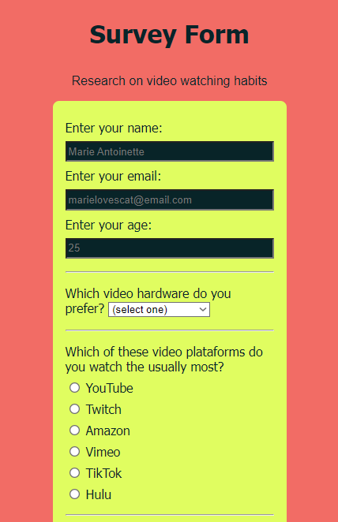
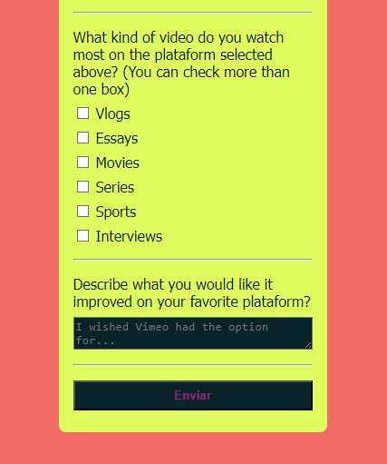

# Survey Form

This is my first project using HTML and CSS from scratch. It was made with the intent of putting to use what was learned on the first part of the course, making proper use of attributes, using clean and concise code to reach the objectives. 

The course is 'Responsive Web Design' on the freeCodeCamp plataform. It was asked to make a survey form following a set of user stories (instructions).

In this mocked page of a survey form, the user is asked to give personal information such as name, email and age, and also answer some questions related to the survey subject, in this case, their video watching habits. At the end, there's an input to submit the form.

All these questions was done using different types of inputs, making a flexible and interactive form with checkboxes, radiobuttons and text area. 

The design may not be the best there is, but I learned a lot on how it is done and will work on improving UI/UX skills. At least, it's not all black and white boring.

## Screenshots

## Links
 - [FreeCodeCamp](https://www.freecodecamp.org/learn)
 - [Responsive Web Design Course](https://www.freecodecamp.org/learn/2022/responsive-web-design)
 - ['Build a Survey Form' Instructions](https://www.freecodecamp.org/learn/2022/responsive-web-design/build-a-survey-form-project/build-a-survey-form)

