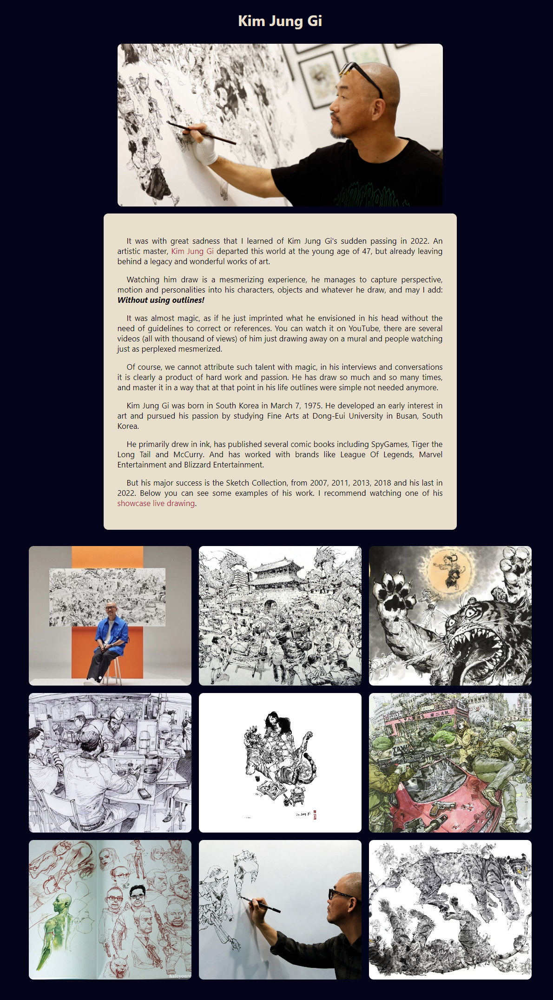

## Tribute Page

This is the second project of this course about fundamentals of HTML and CSS. In this, it was asked to make a tribute page. I choose Kim Jung Gi to honor because of his remarkable talent and the impact his passing had on me. His art will be forever remembered. 

In the page, there's his photo, a small introduction to his life and a gallery with 9 drawings. 

The images are responsive to the size of the screen. On the screenshot below you can see three columns, but if you change the size of the window, it can show one to two columns.

This page version (on this repo) is slightly different from the submitted version, since it was required on the user stories to use a display on ALL the images of block instead of flex. 

## Screenshot

## Observations

- Images are used with links not to images on folder but to other websites that are hosting and can be broken without notice. 

## Links 
 - [FreeCodeCamp](https://www.freecodecamp.org/learn)
 - [Responsive Web Design Course](https://www.freecodecamp.org/learn/2022/responsive-web-design)
- ['Build a Tribute Page' Instructions](https://www.freecodecamp.org/learn/2022/responsive-web-design/build-a-tribute-page-project/build-a-tribute-page)